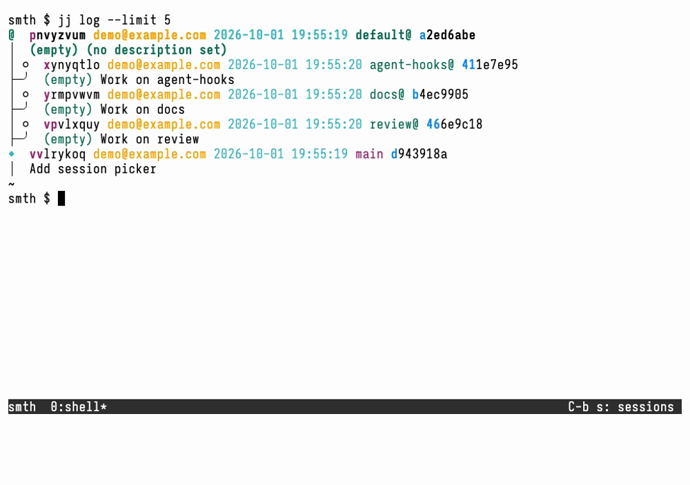
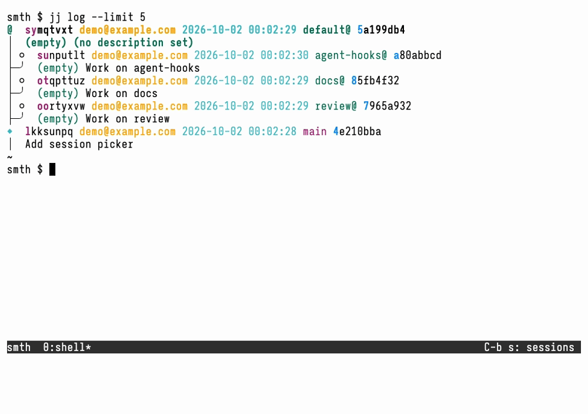
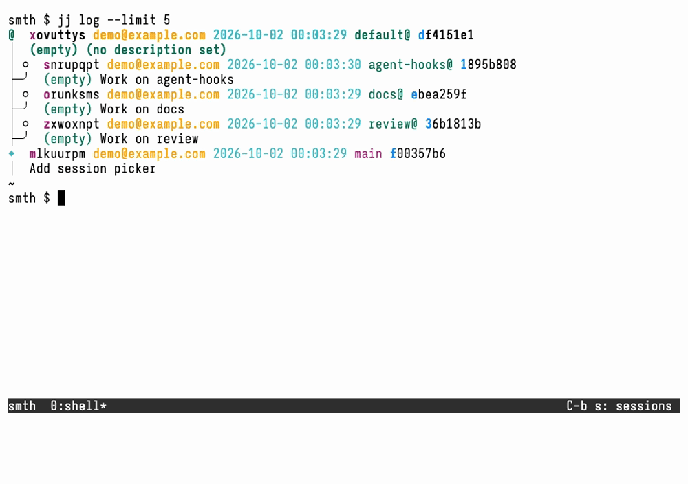
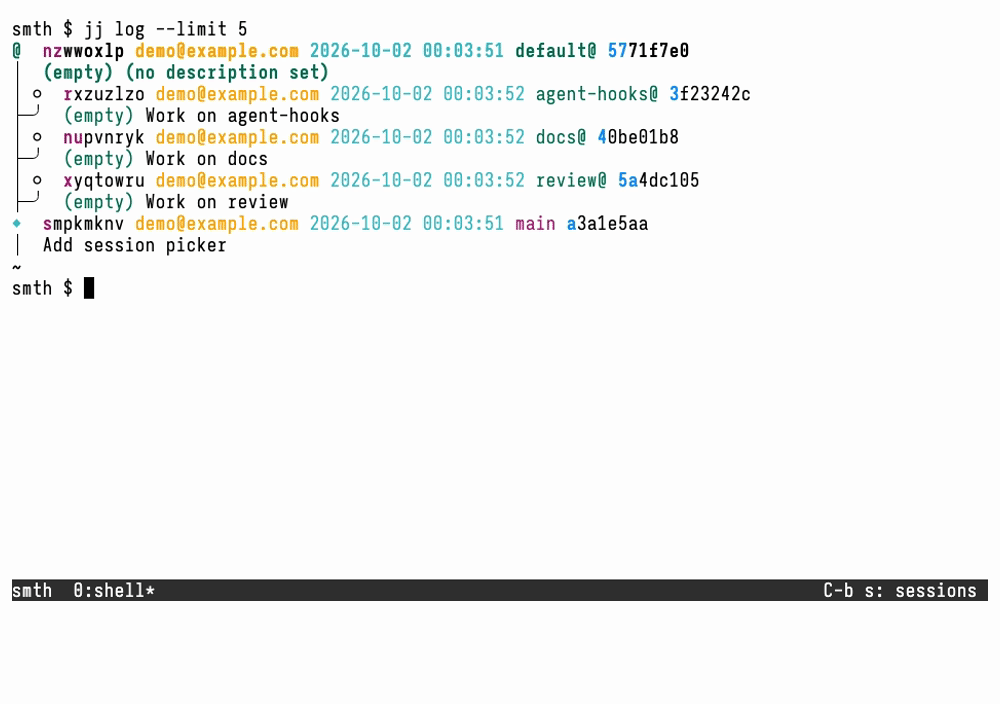
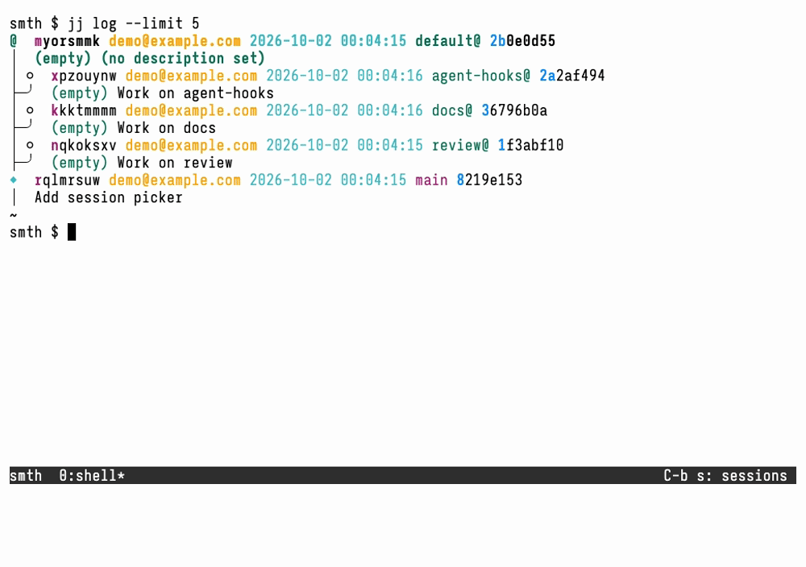
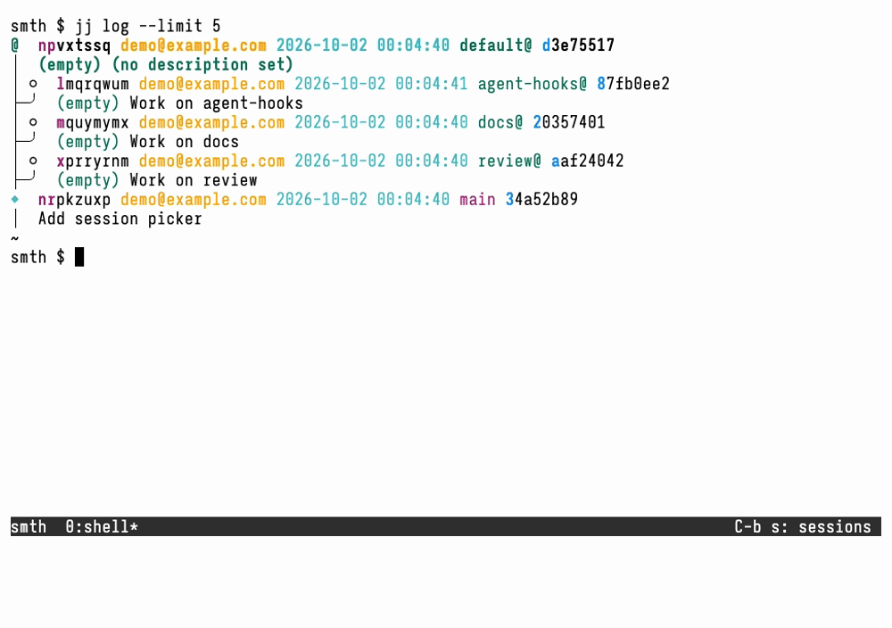

# Session management

Use `smth` inside tmux to open, create, close, and delete sessions. Follow the
[README setup](../README.md#setup) to open the picker in a popup, and see the
[README keybinding table](../README.md#key-bindings) for all shortcuts.

## Session kinds and operations

The picker contains both existing sessions and candidates for sessions that do
not exist yet. The available operations depend on the kind of row:

| Session kind         | Open | Create | Close | Delete |
| -------------------- | ---- | ------ | ----- | ------ |
| New repo             | Yes  | Yes    | No    | No     |
| New workspace        | Yes  | Yes    | No    | No     |
| New tmux             | Yes  | Yes    | No    | No     |
| Live tmux            | Yes  | No     | Yes   | No     |
| Live repo            | Yes  | No     | Yes   | No     |
| Live workspace       | Yes  | No     | Yes   | Yes    |
| Discovered repo      | Yes  | Yes    | No    | No     |
| Discovered workspace | Yes  | Yes    | No    | Yes    |

### Session kinds

- **New repo:** initializes a fresh jj repository with a colocated Git
  repository, then starts a tmux session in its default checkout.
- **New workspace:** creates a named jj workspace and starts a tmux session
  there. The workspace has its own checkout directory but shares the base
  repository's jj history.
- **New tmux:** starts a plain tmux session in the directory where the picker
  was opened, without creating a repository or workspace.
- **Live tmux:** a running tmux session with no associated repository checkout.
- **Live repo:** a running tmux session associated with a repository's default
  checkout, rather than a named workspace.
- **Live workspace:** a running tmux session associated with a named jj
  workspace checkout.
- **Discovered repo:** an existing default checkout found through [repository
  discovery](configuration.md#repository-discovery), with no live tmux session.
- **Discovered workspace:** an existing named jj workspace checkout found
  through repository discovery, with no live tmux session.

The picker marks live sessions with `■` by default. New candidates do not yet
have a checkout or session to close or delete. Opening one changes its kind:
for example, a new workspace becomes a live workspace, while a new repo becomes
a live repo.

## Session ordering and switching

With an empty query, live sessions come before non-live repository candidates.
Live sessions currently attached to a tmux client come first, followed by
unattached sessions. Within each group, the most recently attached comes first;
equal attachment times are ordered by descending session name. Never-attached
sessions follow those with attachment history within their group.

The picker initially selects the first **unattached** live session when the
query is empty. In the usual single-client workflow, that is the previous
session: open the picker and press `enter` to return to it. This is not
always the second row, especially with multiple clients. If no unattached live
session exists, selection falls back to the first discovered match. Switches
made outside smth also affect the order, because smth reads tmux's attachment
history.

Typing fuzzy-filters discovered rows and offers new-session candidates above
them. When starting a query, selection defaults to the first discovered match;
with no matches, it defaults to the last new-session candidate (new tmux when
there is no repository context). Navigate explicitly to a new-session row when
you want something new instead of a match. `C-u` clears the query.

## Open

Select a row and press `enter` to open it. Live sessions are reused, preserving
running programs; smth prefers the first window with a bell or agent attention.
A discovered repo or workspace gets a new tmux session in its existing checkout.
New-session candidates create the required checkout, if any, before starting tmux.

### Choose repository context

The current repository context determines which new-session candidates appear.
Opening the picker inside a jj checkout selects its repository as context.
Select a repo-backed row and press `C-r` to use its repository, or press `M-r`
to clear context. `C-r` on a row without a repository also clears context.
Discovery determines which existing checkouts are listed; it does not by itself
select the context for creating workspaces.

### Open a new repo

Clear repository context with `M-r`, then type a directory name. The picker
offers a new-repo row above the new-tmux row when the destination is available.
Select the new-repo row explicitly, then press `enter` or `C-n`.

The new checkout goes under the configured [repository creation
root](configuration.md#repository-discovery), or the directory where the picker
was opened if no root is configured. Missing parent directories are created.
Names must be non-empty directory names, not `.` or `..` or paths
containing separators. Occupied destinations are not offered; existing
directories are never initialized. Directory names are preserved exactly, while
tmux names are sanitized and disambiguated.

### Open a new workspace

With repository context selected, type a workspace name and select the
new-workspace row. New workspaces start at `trunk()` by default. To choose a
different revision, press `C-o` to open the onto picker, type to search,
navigate with arrows or `tab` / `S-tab`, and press `enter` to accept a
revision. That accepts the revision, not the session; then press `enter` or
`C-n` on the session row. `C-o` or `C-g` cancels onto mode.

A new `feature` workspace normally lives beside the default checkout at
`/path/to/repo.feature`, with tmux name `repo/feature`. New workspace names and
paths are sanitized and disambiguated; collisions add `~N` suffixes. To
reopen an existing checkout instead, select its discovered row, not a
new-workspace candidate.

### Open a new tmux session

Clear repository context with `M-r`, type a name, and select the new-tmux
row. Press `enter` or `C-n` to start the session in the directory where the
picker was opened. No directory or repository is created. New tmux names are
sanitized and disambiguated against existing sessions.

## Create

For any non-live row, `C-n` creates the session **without switching away** and
keeps the picker open. It uses the same repository context and checkout choices
as [Open](#open). Pressing `enter` instead creates it and switches to it.
[Configured tmux setup](configuration.md#tmux-session-setup) runs only when a
new tmux session is created, with either key.

## Close

Select a live session and press `C-x` to close it immediately. This kills its
tmux windows and panes, but leaves its checkout and jj workspace registration
intact. Save any work in running programs first.

Multiple live sessions can refer to the same checkout; these are aliases.
Closing one alias does not close the others.

To reopen a repo-backed session, select its discovered repo or workspace row
and press `enter` or `C-n`. Ensure [discovery
globs](configuration.md#repository-discovery) cover the checkout if you want it
to remain visible after its live session closes. Closing a staged workspace's
session does not clear its deletion marker.

## Delete

**Deletion removes checkout contents, not just tmux sessions.** Only verified
named jj workspaces can be staged or deleted, whether live or discovered; plain
sessions and default checkouts cannot. Save or move anything you need before
confirming.

### Stage, inspect, confirm, or cancel

1. Select a named workspace row (live or discovered) and press `C-d` to stage
   it. Press `C-d` again to unstage it.
2. Navigate or filter to stage more. Filtering does not remove staged targets:
   the footer counts affected session rows, including hidden selections.
3. Press `C-y` to confirm and execute the **entire staged selection**, including
   hidden rows, not just the highlighted row. There is no second prompt.
4. Before confirmation, `C-g` clears all discovered staged markers without
   deleting anything or exiting. If onto mode is open, the first `C-g` only
   cancels onto mode; press it again to clear staged deletions.

`esc` and `C-c` exit the picker **without clearing** staged deletions. Staging is
stored in each named workspace's `.jj/.smth-pending-delete` file, so it survives
picker exits and closing the checkout's live sessions. Markers in checkouts
that are no longer discovered are untouched; keep discovery globs covering
closed checkouts so you can inspect, unstage, or delete them later.

Aliases share one marker: staging or unstaging through either row affects both.
Counts describe session rows, not unique checkouts; execution deletes each
checkout once and closes all its discovered live aliases.

During a background operation, mutating actions and picker exit are disabled,
and the footer hides mutation shortcuts. Query editing and navigation remain
available. `C-g` is not an abort for a deletion already running.

### Partial failures

For each checkout, execution first forgets the workspace in jj, then removes
its directory, then closes its discovered live sessions. Checkouts are processed
concurrently, as are session closures after each removal. All tasks finish
before failures are reported; one failed target does not cancel the others.

A failure can leave a workspace forgotten but its directory present, or its
checkout removed with only some sessions closed. There is no rollback. Inspect
the reported paths and session names, the remaining files, jj workspace
registrations, and live sessions before retrying. Do not assume that an error
means nothing changed or that every failed target is still discoverable as a
staged workspace.
